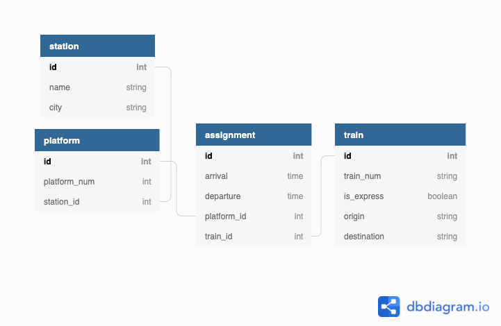

# Validations Station

You've been tasked with designing a system that will automate some operations for a railway system.  For each station in the system, your app will be able to assign incoming trains to a vacant platform, as well as publish the arrival and departure schedules for individual stations.

You'll be adding validations to the provided models as specified below using Flask validations and constraints. There is also some seed data provided in `server/seed.py` to give you some data so you can test your models.

## Setup
cd into server and run the following in Terminal:
* export FLASK_APP=app.py _(if you'll run from the Flask shell)_
* export FLASK_RUN_PORT=5555 _(if you'll run from the Flask shell)_
* flask db init
* flask db revision --autogenerate -m'Create tables' 
* flask db upgrade 
* python seed.py

## Model Associations
The models are already done for you, and associations should be as follows: 

Station --< Platform --< Assignment >--Train

The relationship between `platforms` and `trains` is many-to-many through `assignments` because the same train could be assigned to different platforms in the same station on different days depending on the other traffic through the station.

## Instructions

- Add the appropriate code to each model to meet the requirements below
- Some models may need relationships as well as validations
- You do not need to create api routes or a server appliation for this challenge
- There are no tests, so you'll need to test your code with an API client (Postman, etc.) or using `ipdb` and `debug.py`
- Test your validations by trying to create model objects which deliberately violate them.
- When creating `Assignment` objects, enter `arrival` and `departure` strings in the format "HH:MM" 

## Deliverables

### `Station`
- must have a `name`
- `name` must be at least 3 characters long
- `name` must be unique

### `Platform`
- `platform_num` must be an integer
- `platform_num` must be in the range 1-20 (inclusive)
- BONUS: `platform_num` must be unique to each station

### `Train`
- must have an `origin` and a `destination`
- `origin` and `destination` strings must be between 3 and 24 characters long, inclusive
- `service_type` must be either "express" or "local"

### `Assignment`
- must have `arrival` and `departure` times

BONUS (see the docs on [the @validates decorator](#) to help with these):
- must arrive before it departs
- must not stay at platform for more than 20 minutes
- must only be assigned to a vacant platform